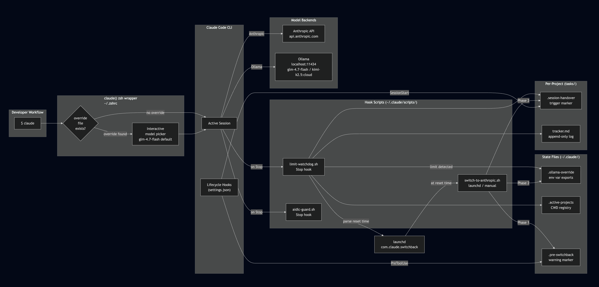
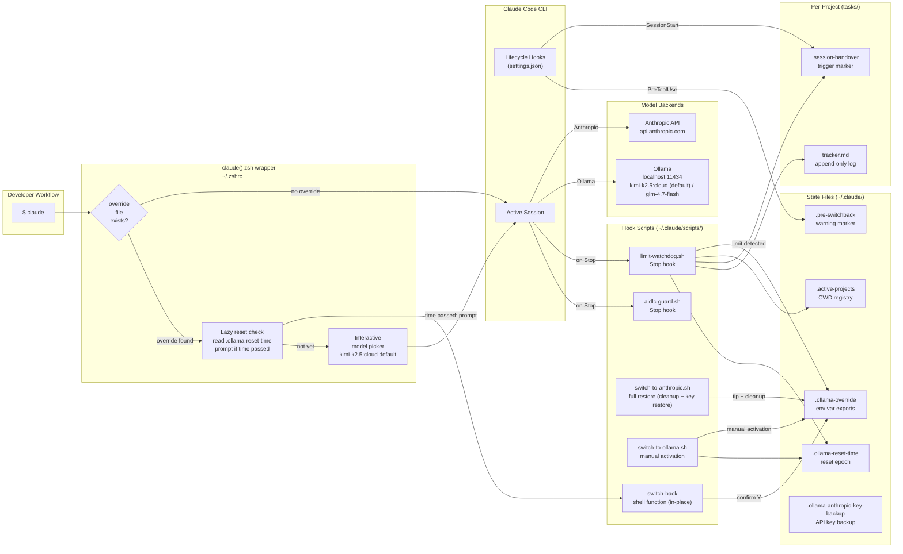
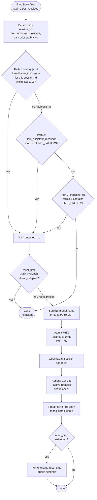
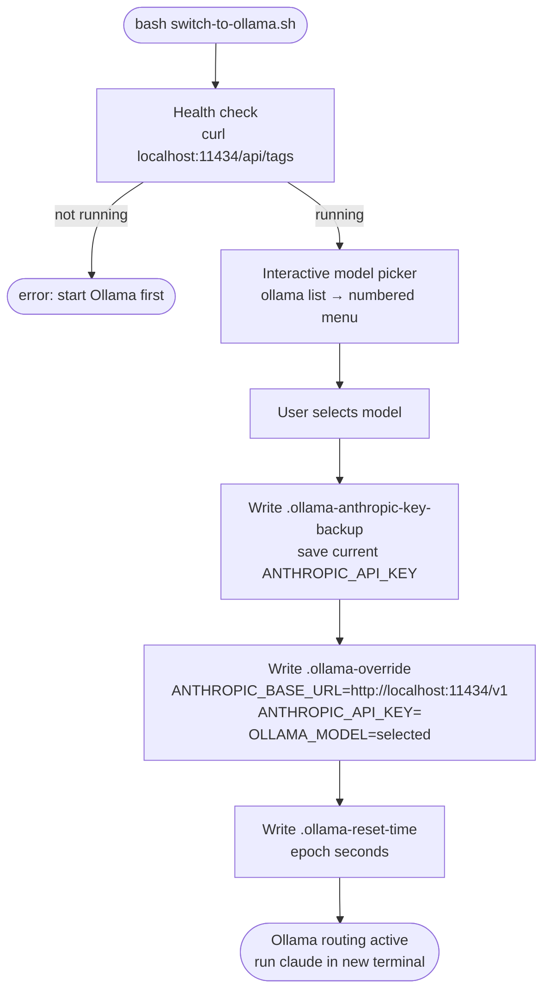
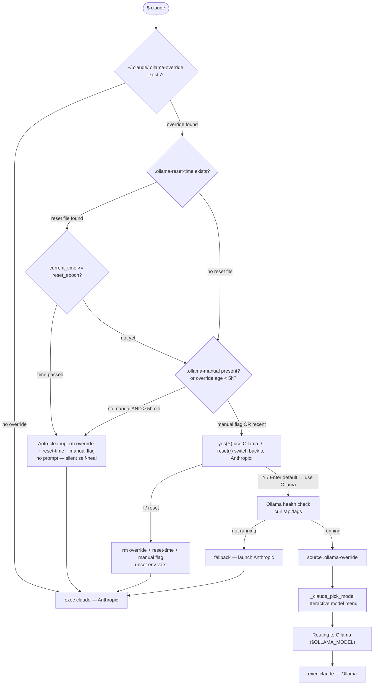
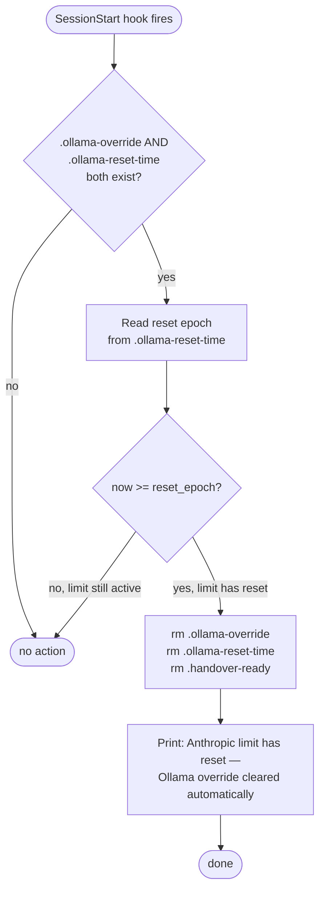
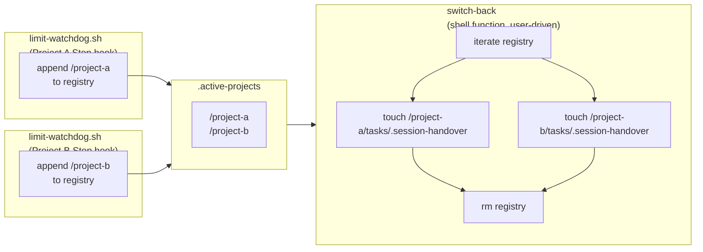
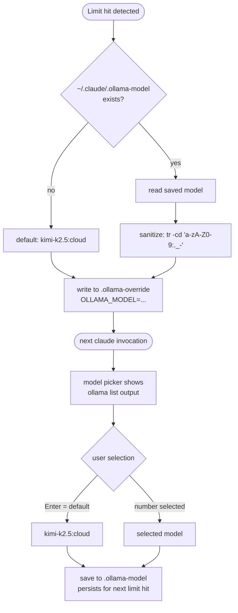
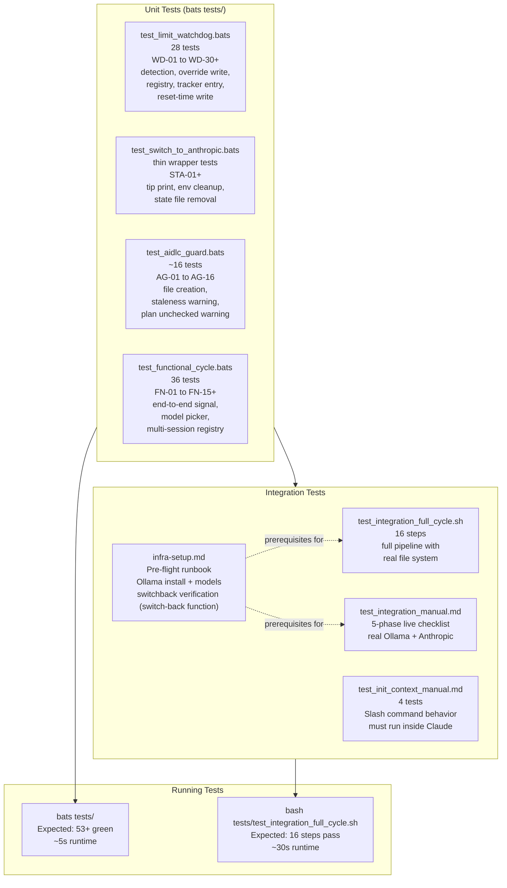

# Local Model Switchover — Design Reference

Zero-downtime continuity when Anthropic usage limits hit. Claude Code automatically
reroutes to a local (or cloud-proxied) Ollama model, preserves session context,
and switches back when Anthropic limits reset — with no manual steps required.

---

## Table of Contents

1. [Architecture Overview](#architecture-overview)
2. [Full Switchover Cycle — Sequence Diagram](#full-switchover-cycle--sequence-diagram)
3. [Component Deep Dives](#component-deep-dives)
   - [limit-watchdog.sh — Three-Path Detection](#limit-watchdogsh--three-path-detection)
   - [switch-to-anthropic.sh — Full Restore Script](#switch-to-anthropicsh--full-restore-script)
   - [switch-back shell function — In-Place Switchback](#switch-back-shell-function--in-place-switchback)
   - [switch-to-ollama.sh — Manual Ollama Activation](#switch-to-ollamash--manual-ollama-activation)
   - [claude() wrapper — Transparent Model Routing](#claude-wrapper--transparent-model-routing)
   - [AIDLC Guard — Session Discipline](#aidlc-guard--session-discipline)
4. [Key Files & Markers](#key-files--markers)
5. [Multi-Session Registry](#multi-session-registry)
6. [Model Selection](#model-selection)
7. [Infrastructure Setup](#infrastructure-setup)
8. [Manual Integration Tests](#manual-integration-tests)
9. [init-context Tests](#init-context-tests)
10. [Test Architecture](#test-architecture)

---

## Architecture Overview





---

## Full Switchover Cycle — Sequence Diagram

```mermaid
sequenceDiagram
    actor Dev as Developer
    participant ZSH as claude() wrapper
    participant CC as Claude Code
    participant WD as limit-watchdog.sh
    participant AG as aidlc-guard.sh
    participant STO as switch-to-ollama.sh
    participant SB as switch-back function
    participant ANTH as Anthropic API
    participant OLL as Ollama (local/cloud)
    participant FS as File System

    rect rgb(230, 245, 230)
        Note over Dev,FS: PHASE 1 — Normal Anthropic Session
        Dev->>ZSH: $ claude
        ZSH->>FS: check ~/.claude/.ollama-override
        FS-->>ZSH: not found
        ZSH->>CC: launch (no override)
        CC->>ANTH: connect (ANTHROPIC_API_KEY)
        ANTH-->>CC: session active
        CC-->>Dev: Claude Code running (sonnet/opus)
        Note over CC,ANTH: Normal coding session proceeds
    end

    rect rgb(255, 235, 235)
        Note over Dev,FS: PHASE 2 — Limit Hit & Detection
        ANTH->>CC: "You've hit your limit · resets 11:30pm"
        CC->>CC: session ends
        CC->>WD: Stop hook fires (stdin JSON with session_id,\nlast_assistant_message, transcript_path, cwd)

        Note over WD: Three-path detection (in priority order)

        WD->>FS: [Path 1] check ~/.claude/history.jsonl<br/>for /rate-limit-options entry<br/>(session_id + timestamp within 120s)
        alt history match found (deterministic)
            FS-->>WD: limit_detected=1
        else no history match
            WD->>WD: [Path 2] grep last_assistant_message<br/>against LIMIT_PATTERN regex
            alt text pattern matches
                WD->>WD: limit_detected=1, extract reset_time
            else no text match
                WD->>FS: [Path 3] grep transcript file
                FS-->>WD: limit_detected=1, extract reset_time
            end
        end

        WD->>FS: write ~/.claude/.ollama-override (atomic tmp+mv)<br/>ANTHROPIC_AUTH_TOKEN=ollama<br/>ANTHROPIC_API_KEY=""<br/>ANTHROPIC_BASE_URL=http://localhost:11434/v1<br/>OLLAMA_MODEL=kimi-k2.5:cloud
        WD->>FS: write ~/.claude/.ollama-anthropic-key-backup<br/>(API key saved before zeroing)
        WD->>FS: touch tasks/.session-handover
        WD->>FS: append cwd → ~/.claude/.active-projects (dedup)
        WD->>FS: prepend limit-hit entry → tasks/tracker.md
        WD->>FS: write ~/.claude/.ollama-reset-time<br/>(epoch seconds of reset time)

        CC->>AG: aidlc-guard.sh runs (second Stop hook)
        AG->>FS: create tasks/lessons.md if missing
        AG->>FS: create tasks/todo.md if missing
        AG->>FS: check tracker.md staleness (>2h warning)
        AG->>FS: check docs/plan.md for unchecked items
        AG-->>Dev: AIDLC warnings (non-fatal)
    end

    rect rgb(230, 240, 255)
        Note over Dev,FS: PHASE 3 — Ollama Session with Context Handover
        Note over Dev,STO: Manual activation path (optional): Dev->>STO: bash switch-to-ollama.sh
        STO->>FS: health check Ollama → interactive model picker
        STO->>FS: write ~/.claude/.ollama-override
        STO->>FS: write ~/.claude/.ollama-reset-time (epoch)
        STO->>FS: write ~/.claude/.ollama-anthropic-key-backup

        Dev->>ZSH: $ claude (new terminal)
        ZSH->>FS: check ~/.claude/.ollama-override
        FS-->>ZSH: found!
        ZSH->>FS: read ~/.claude/.ollama-reset-time
        ZSH->>ZSH: current_time < reset_epoch → stay on Ollama
        ZSH->>OLL: health check curl /api/tags
        OLL-->>ZSH: running
        ZSH->>ZSH: source override file
        ZSH->>Dev: show model picker<br/>[1] kimi-k2.5:cloud  ← default (press Enter)<br/>[2] glm-4.7-flash<br/>[3] qwen3:4b ...
        Dev->>ZSH: [Enter] (or select number)
        ZSH->>FS: save choice → ~/.claude/.ollama-model
        ZSH->>OLL: ollama launch claude --model kimi-k2.5:cloud
        CC->>CC: SessionStart hook fires
        CC->>FS: check tasks/.session-handover
        FS-->>CC: found!
        CC->>CC: run /init-context
        CC->>FS: read tasks/tracker.md (top entries)
        CC->>FS: read tasks/todo.md
        CC->>FS: read docs/plan.md
        CC-->>Dev: "Resumed session — [briefing of in-progress work]"
        CC->>FS: rm tasks/.session-handover
        CC->>OLL: tool calls routed to localhost:11434/v1
        OLL-->>CC: responses from local model
        CC-->>Dev: coding continues with full context
    end

    rect rgb(255, 245, 220)
        Note over Dev,FS: PHASE 4a — Auto-Cleanup (reset time has passed)
        Note over Dev,ZSH: No prompt — claude() wrapper detects stale override and self-heals

        Dev->>ZSH: $ claude
        ZSH->>FS: check ~/.claude/.ollama-override
        FS-->>ZSH: found!
        ZSH->>FS: read ~/.claude/.ollama-reset-time
        ZSH->>ZSH: current_time >= reset_epoch → auto-cleanup (no prompt)
        ZSH->>FS: rm ~/.claude/.ollama-override
        ZSH->>FS: rm ~/.claude/.ollama-reset-time
        ZSH->>FS: rm ~/.claude/.pre-switchback (if present)
        ZSH->>FS: rm ~/.claude/.ollama-manual (if present)
        ZSH->>ZSH: unset ANTHROPIC_BASE_URL ANTHROPIC_AUTH_TOKEN OLLAMA_MODEL
        ZSH->>CC: launch (no override — Anthropic)
    end

    rect rgb(255, 235, 200)
        Note over Dev,FS: PHASE 4b — Active Ollama Session (reset time not yet passed)
        Note over Dev,ZSH: User runs claude — wrapper shows routing prompt

        Dev->>ZSH: $ claude
        ZSH->>FS: check ~/.claude/.ollama-override
        FS-->>ZSH: found!
        ZSH->>FS: read ~/.claude/.ollama-reset-time
        ZSH->>ZSH: current_time < reset_epoch (or no reset time, within 5h, or manual flag present)
        ZSH->>Dev: "yes(Y) use Ollama  /  reset(r) switch back to Anthropic:"
        Dev->>ZSH: r

        ZSH->>FS: rm ~/.claude/.ollama-override
        ZSH->>FS: rm ~/.claude/.ollama-reset-time
        ZSH->>FS: rm ~/.claude/.ollama-manual (if present)
        ZSH->>ZSH: unset ANTHROPIC_BASE_URL ANTHROPIC_AUTH_TOKEN OLLAMA_MODEL
        ZSH->>CC: launch (no override — Anthropic)
    end

    rect rgb(230, 245, 230)
        Note over Dev,FS: PHASE 5 — Anthropic Session Resumes
        Dev->>ZSH: $ claude (new terminal)
        ZSH->>FS: check ~/.claude/.ollama-override
        FS-->>ZSH: not found
        ZSH->>FS: remove PWD from ~/.claude/.active-projects (cleanup)
        ZSH->>CC: launch (no override)
        CC->>CC: SessionStart hook fires
        CC->>FS: check tasks/.session-handover
        FS-->>CC: found!
        CC->>CC: run /init-context
        CC->>FS: read tracker.md, todo.md, plan.md
        CC-->>Dev: "Resumed session — [briefing including Ollama work]"
        CC->>FS: rm tasks/.session-handover
        CC->>ANTH: connect (ANTHROPIC_API_KEY restored)
        CC-->>Dev: full continuity — Anthropic session with complete context
    end
```



---

## Component Deep Dives

### limit-watchdog.sh — Three-Path Detection

Fired by the `Stop` hook at the end of every Claude Code session. Receives a JSON payload via stdin. Detection runs in priority order — the first match wins and subsequent paths are skipped.



**Reset-time guard:** After limit detection, if `$reset_time` was extracted from the message and the parsed epoch is already in the past (limit window already closed by the time the hook fires), `limit-watchdog.sh` exits without writing `.ollama-override`. This prevents writing a permanent Ollama override for a limit that has already reset — the most common cause of stale sentinel files persisting for hours or days.

**Detection signal hierarchy:**

| Path | Signal type | Speed | Reliability |
| ------ | ------------- | ------- | ------------- |
| 1. `history.jsonl` | Machine-written JSON `/rate-limit-options` | O(file scan) | Deterministic — no text parsing |
| 2. `last_assistant_message` | Regex on known limit phrases | O(1) | High — inline in hook payload |
| 3. Transcript file | Grep on full session transcript | O(file size) | Fallback — always present |

---

### switch-to-anthropic.sh — Full Restore Script

Full counterpart to `switch-to-ollama.sh`. Restores Anthropic routing, recovers the API key via a three-path fallback chain, cleans all sentinel files, and sends a desktop notification. Works correctly when sourced (env vars update in the calling shell) or run as a subprocess (file cleanup still happens; prints the `unset` commands the user needs to run manually).

```mermaid
sequenceDiagram
    actor Dev as Developer
    participant STA as switch-to-anthropic.sh
    participant FS as File System

    Dev->>STA: source ~/.claude/scripts/switch-to-anthropic.sh
    STA->>FS: Path 1 — read ANTHROPIC_API_KEY from .ollama-anthropic-key-backup
    alt backup file present
        FS-->>STA: key restored; rm .ollama-anthropic-key-backup
    else no backup
        STA->>FS: Path 2 — read key from ~/.claude/.credentials (Linux store)
        alt .credentials present
            FS-->>STA: key from anthropicApiKey field
        else no .credentials
            STA->>STA: Path 3 — security find-generic-password (macOS Keychain)
        end
    end
    STA->>STA: unset ANTHROPIC_BASE_URL, ANTHROPIC_AUTH_TOKEN, OLLAMA_MODEL
    STA->>STA: export ANTHROPIC_API_KEY (if restored)
    STA->>FS: rm .ollama-override, .ollama-reset-time, .pre-switchback, .ollama-manual
    STA->>Dev: desktop notification + summary
    STA->>Dev: "Run: claude"
```

**Key design decisions:**

- Three-path key restoration covers all platforms: backup file (all), Linux `.credentials`, macOS Keychain
- Safe to run multiple times (idempotent `rm -f` operations)
- When sourced: env vars update in the calling shell directly
- When run as subprocess: prints `unset` commands for the user to run; recommends `switch-back`

---

### switch-back shell function — In-Place Switchback

Shell function installed to `~/.zshrc` by `install.sh`. Runs in the current terminal process so it can update env vars in-place (a subprocess cannot export to the parent shell).

```mermaid
flowchart TD
    START([switch-back]) --> OVR{.ollama-override\nexists?}
    OVR -- no --> NOOP([nothing to do\nalready on Anthropic])

    OVR -- yes --> KEY[Read ANTHROPIC_API_KEY\nfrom .ollama-anthropic-key-backup]
    KEY --> RESTORE[export ANTHROPIC_API_KEY=restored_key\nunset ANTHROPIC_BASE_URL\nunset ANTHROPIC_AUTH_TOKEN]
    RESTORE --> CLEAN[rm .ollama-override\nrm .ollama-reset-time\nrm .pre-switchback]
    CLEAN --> REG[Iterate .active-projects\ntouch {project}/tasks/.session-handover\nper project]
    REG --> RMREG[rm .active-projects]
    RMREG --> DONE([Switched back to Anthropic\nnew terminal ready])
```

**Key design decisions:**

- Must run as a shell function (not a script) to mutate the current terminal's env vars
- Reads API key from `.ollama-anthropic-key-backup` — the key was zeroed in the override, backup is the source of truth
- Registry iteration ensures all active projects get a `.session-handover` trigger for context reload

---

### switch-to-ollama.sh — Manual Ollama Activation

Manually activates Ollama routing without waiting for a limit hit. Useful for testing, cost control, or when you want to route to a local model by choice.



---

### claude() wrapper — Transparent Model Routing

Shell function installed to `~/.zshrc` by `install.sh`. The developer always types `claude` — routing is invisible. Includes a lazy reset-time check: every launch inspects `.ollama-reset-time` and either auto-cleans up silently (reset time passed) or shows a routing prompt (still within window).



---

### AIDLC Guard — Session Discipline

Runs alongside `limit-watchdog.sh` on every `Stop` event. Non-fatal — uses `set +e` throughout. Ensures tracking files are never lost.

```mermaid
flowchart TD
    START([Stop hook fires]) --> CWD[Resolve CWD\nPROJECT_CWD env or PWD]
    CWD --> MKDIRS[mkdir -p tasks/ docs/ audit/]
    MKDIRS --> L{tasks/lessons.md\nexists?}
    L -- no --> CL[Create stub\nwith header template]
    CL --> LW[warn: add lesson entry\nbefore ending session]
    L -- yes --> T
    LW --> T{tasks/todo.md\nexists?}
    T -- no --> CT[Create stub\nwith section headers]
    CT --> TRK
    T -- yes --> TRK{tasks/tracker.md\nexists?}
    TRK -- no --> WM[warn: missing tracker\nrun /log-context]
    TRK -- yes --> AGE[Extract timestamp\nfrom top entry]
    AGE --> OLD{entry age\n> 2 hours?}
    OLD -- yes --> WA[warn: tracker stale\nrun /log-context]
    OLD -- no --> PLAN
    WM --> PLAN
    WA --> PLAN{docs/plan.md\nexists?}
    PLAN -- yes --> UNC[Count unchecked\n- [ ] items]
    UNC --> UNCH{unchecked\n> 0?}
    UNCH -- yes --> WP[warn: N unchecked steps\nmark completed items as x]
    UNCH -- no --> DONE
    PLAN -- no --> DONE
    WP --> DONE([done — non-fatal])
```

---

### SessionStart Auto-Expire Hook — Stale Sentinel Cleanup

Runs at every Claude Code session start regardless of how Claude was launched (terminal, Mac app, IDE extension). Cleans up stale Ollama sentinel files when the Anthropic reset epoch has already passed — the primary recovery path for machines that use the Mac app or IDE where the `claude()` terminal wrapper never runs.



**Why this matters:** The terminal `claude()` wrapper performs the same lazy reset check on every launch, but only fires in terminal sessions. The Mac app and IDE extensions launch Claude Code directly and never hit the wrapper. Before this hook, sentinel files would persist indefinitely on setups where the Mac app is the primary entry point — causing every session to be routed to Ollama long after the Anthropic limit reset.

---

## Key Files & Markers

| File | Location | Purpose | Lifecycle |
| ------ | ---------- | --------- | ----------- |
| `.ollama-override` | `~/.claude/` | Env var exports that reroute Claude Code to Ollama | Written by watchdog / switch-to-ollama; removed by switch-back / claude() wrapper |
| `.active-projects` | `~/.claude/` | One absolute CWD per line — all active Ollama sessions | Appended by watchdog; cleared by switch-back |
| `.pre-switchback` | `~/.claude/` | One-shot marker — tells Ollama session to run /log-context | Written before switchback; consumed by PreToolUse hook or removed by switch-back |
| `.ollama-model` | `~/.claude/` | Persisted model selection | Written by model picker; read by watchdog on next limit hit |
| `.ollama-reset-time` | `~/.claude/` | Reset epoch (seconds) for lazy switchback check | Written by watchdog + switch-to-ollama; deleted by switch-back / claude() wrapper |
| `.ollama-anthropic-key-backup` | `~/.claude/` | API key backup before override zeroes it | Written by watchdog + switch-to-ollama; deleted by switch-back |
| `.session-handover` | `{project}/tasks/` | Triggers `/init-context` on next session start | Written by watchdog + switch-back; deleted by SessionStart hook after load |
| `tracker.md` | `{project}/tasks/` | Append-only session log | Prepended by watchdog, switch-back, PreCompact hook, and /log-context |

---

## Multi-Session Registry

When multiple projects are open simultaneously and the Anthropic limit hits:



**Design properties:**

- Append-only registry is safe under concurrent writes (each watchdog appends one line)
- Dedup check (`grep -qxF "$cwd"`) prevents the same CWD from appearing twice
- Switchback iterates the full registry — no project is left behind
- `claude()` wrapper removes the current project from the registry when a fresh Anthropic session starts (no override file path), keeping the registry clean over time

---

## Model Selection



### Model Reference

| Model | RAM | Context | Type | Best for |
| ------- | ----- | --------- | ------ | ---------- |
| `kimi-k2.5:cloud` | 0 GB | 128K | Cloud (Ollama auth) | **Default** — Claude Code agentic tasks, tool calling; requires Ollama account + Device Key |
| `glm-4.7-flash` | 5–6 GB | 128K | Local | Local alternative — no auth needed, GPU/RAM required |
| `qwen3:4b` | 2.5 GB | 128K | Local | Fast iteration, tight RAM budget |
| `qwen3:30b` | 20+ GB | 128K | Local | Best local reasoning quality |
| `qwen2.5-coder:7b` | 4.7 GB | 32K | Local | Code generation on constrained machines |
| `smollm2:360m` | ~500 MB | 8K | Local | CI / bats tests only — not for coding sessions |

**Cloud model prerequisites (kimi-k2.5:cloud):**

1. Free Ollama account: [https://ollama.com]
2. Register Device Key: [https://ollama.com/settings/keys]
3. Authenticate: `ollama auth` in terminal
4. Usage limits apply — track at [https://ollama.com/settings]

---

## Infrastructure Setup

Complete prerequisites before running integration or manual tests.

### Step 1 — Install Ollama

```bash
brew install ollama
ollama --version   # verify: ollama version X.Y.Z
```

### Step 2 — Start Ollama Server

```bash
ollama serve &
curl -s http://localhost:11434/api/tags | python3 -m json.tool | head -5
# Expected: JSON with "models" key
```

### Step 3 — Pull Models

```bash
# Required (used by bats unit tests, ~726 MB):
ollama pull smollm2:360m

# Recommended default for Claude Code sessions (128K context, cloud-proxied):
ollama pull kimi-k2.5:cloud   # requires: ollama auth first

# Optional alternatives (see Model Reference table above):
ollama pull glm-4.7-flash     # local fallback (5–6 GB RAM required)
ollama pull qwen3:4b
ollama pull qwen3:30b
ollama pull qwen2.5-coder:7b
```

### Step 4 — Verify Anthropic API Key

```bash
echo $ANTHROPIC_API_KEY | head -c 10
# Expected: sk-ant-... (first 10 chars only)
```

### Step 5 — Verify Override Mechanism

```bash
# Simulate what watchdog writes:
cat > /tmp/test-override <<'EOF'
export ANTHROPIC_AUTH_TOKEN=ollama
export ANTHROPIC_API_KEY=""
export ANTHROPIC_BASE_URL=http://localhost:11434/v1
EOF
source /tmp/test-override
echo "BASE_URL=$ANTHROPIC_BASE_URL"   # → http://localhost:11434/v1
unset ANTHROPIC_AUTH_TOKEN ANTHROPIC_API_KEY ANTHROPIC_BASE_URL
rm /tmp/test-override
```

### Step 6 — Verify Switchback Mechanism

```bash
# Verify switch-back function is available in your shell:
type switch-back   # should show function definition

# Simulate a limit hit, then test switch-back:
echo "sk-ant-testkey" > ~/.claude/.ollama-anthropic-key-backup
echo "$(date +%s)" > ~/.claude/.ollama-reset-time
touch ~/.claude/.ollama-override
switch-back   # restores key, cleans up state files

# Verify cleanup:
ls ~/.claude/.ollama-override 2>/dev/null || echo "cleaned up OK"
```

### Full Readiness Check

```bash
echo "=== Ollama Infra Readiness ===" && \
  ollama --version && echo "OK Ollama installed" && \
  curl -sf http://localhost:11434/api/tags > /dev/null && echo "OK Ollama server running" && \
  ollama list | grep -q smollm2 && echo "OK smollm2:360m present" && \
  ollama list | grep -qE 'glm-4.7-flash|kimi-k2.5|qwen3' && echo "OK coding model present" && \
  [ -f ~/.claude/scripts/limit-watchdog.sh ] && echo "OK limit-watchdog.sh deployed" && \
  [ -f ~/.claude/scripts/switch-to-anthropic.sh ] && echo "OK switch-to-anthropic.sh deployed" && \
  [ -f ~/.claude/scripts/switch-to-ollama.sh ] && echo "OK switch-to-ollama.sh deployed" && \
  [ -f ~/.claude/scripts/aidlc-guard.sh ] && echo "OK aidlc-guard.sh deployed" && \
  type switch-back > /dev/null 2>&1 && echo "OK switch-back function available" && \
  echo "OK All checks passed — ready for integration tests"
```

---

## Manual Integration Tests

Full 5-phase live validation. Run in order. Each phase has observable pass criteria.

### Pre-flight

```bash
ollama serve &
echo $ANTHROPIC_API_KEY | head -c 10   # verify key set
ls ~/.claude/.ollama-override 2>/dev/null && echo EXISTS || echo clean        # should be clean
ls ~/.claude/.ollama-reset-time 2>/dev/null && echo EXISTS || echo clean      # should be clean
ls tasks/.session-handover 2>/dev/null && echo EXISTS || echo clean           # should be clean
type switch-back   # verify shell function is loaded
```

---

### Phase 1 — Normal Anthropic Session

**Action:** `claude` in your demo project.

**Pass criteria:**

- [ ] Claude Code starts with Anthropic model (sonnet/opus)
- [ ] Session works — make a small change or ask a question
- [ ] AIDLC files exist: `tasks/todo.md`, `tasks/tracker.md`

---

### Phase 2 — Simulate Limit Hit

```bash
# In a separate terminal (don't stop the session):
bash ~/.claude/scripts/limit-watchdog.sh <<'JSON'
{
  "last_assistant_message": "You've hit your limit · resets 12:30am",
  "transcript_path": "/dev/null",
  "cwd": "/absolute/path/to/demo/repo"
}
JSON
```

**Pass criteria:**

- [ ] `cat ~/.claude/.ollama-override` shows:

  ```bash
  export ANTHROPIC_AUTH_TOKEN=ollama
  export ANTHROPIC_API_KEY=""
  export ANTHROPIC_BASE_URL=http://localhost:11434/v1
  export OLLAMA_MODEL=kimi-k2.5:cloud
  ```

- [ ] `ls tasks/.session-handover` — file exists
- [ ] `cat ~/.claude/.active-projects` — shows demo repo path
- [ ] `cat ~/.claude/.ollama-reset-time` — shows epoch seconds
- [ ] `cat ~/.claude/.ollama-anthropic-key-backup` — shows backed-up API key prefix
- [ ] `tasks/tracker.md` top entry is `[Limit Hit — Session Terminated]`

---

### Phase 3 — Ollama Session with AIDLC Handover

```bash
# New terminal — claude() wrapper auto-detects override:
claude
```

**Pass criteria:**

- [ ] `[claude] Limit override active` message shown
- [ ] Model picker appears with numbered list (default: kimi-k2.5:cloud)
- [ ] After selection: Claude Code starts, routes to Ollama
- [ ] `SessionStart` hook fires — Claude checks for `tasks/.session-handover`
- [ ] Claude announces: "Resumed session detected — running /init-context"
- [ ] `/init-context` output shows tracker.md, todo.md, plan.md contents loaded
- [ ] `tasks/.session-handover` deleted: `ls tasks/.session-handover` → `No such file`
- [ ] Responses come from local Ollama: `echo $ANTHROPIC_BASE_URL` → `http://localhost:11434/v1`

---

### Phase 4 — Manual Switchback

```bash
# Option A: run switch-back directly in terminal (restores env vars in-place):
switch-back

# Option B: just run claude — lazy reset check fires and prompts you:
claude
# → "Anthropic limits have reset. Switch back? [Y/n]"
```

**Pass criteria:**

- [ ] `~/.claude/.ollama-override` is gone
- [ ] `~/.claude/.ollama-reset-time` is gone
- [ ] `tasks/.session-handover` created (for each project in registry)
- [ ] `~/.claude/.active-projects` deleted
- [ ] `ANTHROPIC_API_KEY` restored in current terminal (when using `switch-back`)
- [ ] Terminal message: "Switched back to Anthropic — run claude in new terminal"

---

### Phase 5 — Anthropic Session Resumes

```bash
# New terminal, no override:
claude
```

**Pass criteria:**

- [ ] Claude Code starts with Anthropic model (no `[claude] Limit override active` message)
- [ ] `SessionStart` hook fires — detects `tasks/.session-handover`
- [ ] Claude announces "Resumed session" and loads context
- [ ] Briefing includes work done in the Ollama session
- [ ] `tasks/.session-handover` deleted after load
- [ ] `echo $ANTHROPIC_BASE_URL` → empty (default Anthropic)

---

### Post-Demo Cleanup

```bash
rm -f ~/.claude/.ollama-override
rm -f ~/.claude/.ollama-reset-time
rm -f ~/.claude/.ollama-anthropic-key-backup
rm -f ~/.claude/.active-projects
rm -f ~/.claude/.pre-switchback
rm -f tasks/.session-handover
```

---

### Demo Script (for live presentation)

| Beat | Action | Show audience |
| ------ | -------- | --------------- |
| "Normal session" | `claude` in demo repo | Claude Code running, Anthropic model |
| "Limit hits" | Run watchdog with fake JSON | `.ollama-override` + `.ollama-reset-time` + `.session-handover` appear |
| "Switch to local" | `claude` in new terminal | Lazy check skips (not yet), model picker → Ollama session, /init-context fires |
| "Work continues" | Ask Claude to continue the todo | Response from local model, context intact |
| "Switchback" | `switch-back` in terminal | Key restored, override + reset-time files gone |
| "Back to Anthropic" | `claude` in new terminal | Context loaded again, full continuity |

---

## init-context Tests

These tests must be run manually inside an active Claude Code session.
Automated bats tests cannot exercise slash commands.

**Prerequisites:**

```bash
# /init-context synced to ~/.claude/commands/
bash install.sh   # ensures commands/ is synced
# Project has AIDLC structure (run /init-repo if new project)
```

---

### Test 1 — Silent Skip on Fresh Session

**Setup:** `rm -f tasks/.session-handover`

**Action:** Start a new Claude Code session and type anything.

**Expected:** `SessionStart` hook fires, no handover marker found, session starts normally with no context-loading output.

**Pass criteria:**

- [ ] No "HANDOVER_FOUND" output
- [ ] Session starts normally in under 2 seconds

---

### Test 2 — Context Loads When Marker Exists

**Setup:**

```bash
touch tasks/.session-handover
echo "# Tracker\n## 2026-03-21 10:00:00 — Implement watchdog\n**Type:** task-complete\n**Next:** Run bats tests" > tasks/tracker.md
echo "# Todo\n## In Progress\n- [ ] Run bats tests" > tasks/todo.md
echo "# Plan Log\n---\n2026-03-21 - Implement Ollama switchover" > docs/plan.md
```

**Action:** `claude` (new session)

**Expected:** SessionStart hook detects marker, runs `/init-context`, Claude outputs a briefing paragraph summarizing in-progress work.

**Pass criteria:**

- [ ] Claude outputs a briefing paragraph
- [ ] Briefing mentions "Run bats tests" (the active task)
- [ ] `tasks/.session-handover` deleted: `ls tasks/.session-handover` → non-zero exit

---

### Test 3 — Marker Deleted After Load

Verify after Test 2:

```bash
ls tasks/.session-handover
# Expected: No such file or directory
```

**Pass criteria:** [ ] File does not exist

---

### Test 4 — Missing AIDLC Files Triggers /init-repo

**Setup:**

```bash
touch tasks/.session-handover
rm -f tasks/tracker.md tasks/todo.md docs/plan.md
```

**Action:** `claude` (new session)

**Expected:** `/init-context` detects marker + missing files → runs `/init-repo` to create stubs → outputs briefing from stubs.

**Pass criteria:**

- [ ] `/init-repo` output visible in session
- [ ] Stub files created with correct headers
- [ ] Context briefing still produced

---

### End-to-End Cycle (CLI simulation)

```bash
# 1. Simulate limit hit
bash ~/.claude/scripts/limit-watchdog.sh <<'JSON'
{"last_assistant_message": "hit your limit · resets 12:30am",
 "transcript_path": "/dev/null",
 "cwd": "/path/to/project"}
JSON

# 2. Verify artifacts
cat ~/.claude/.ollama-override       # → env var exports (BASE_URL includes /v1)
cat ~/.claude/.ollama-reset-time     # → epoch seconds
ls tasks/.session-handover           # → exists

# 3. Start Ollama-routed session
claude   # wrapper detects override, lazy check passes (not yet), shows picker, /init-context fires

# 4. Simulate switchback (in-place, no scheduler needed)
switch-back   # restores API key, cleans override + reset-time

# 5. Back to Anthropic
claude   # no override, /init-context loads Ollama session context
```

---

## Test Architecture



### Quick Test Run

```bash
cd /path/to/claude-local-starter

# All unit + functional tests:
bats tests/

# Integration pipeline:
bash tests/test_integration_full_cycle.sh

# Specific suite:
bats tests/test_limit_watchdog.bats
bats tests/test_switch_to_anthropic.bats
bats tests/test_aidlc_guard.bats
bats tests/test_functional_cycle.bats
```

### Test Coverage Map

| Component | Test file | Key scenarios |
| ----------- | ----------- | --------------- |
| `limit-watchdog.sh` | `test_limit_watchdog.bats` | Normal exit (no action), history.jsonl primary detection, text pattern detection, transcript fallback, override write (atomic), key backup write, registry append (dedup), tracker entry, reset-time write, time parsing, injection guards |
| `switch-to-anthropic.sh` | `test_switch_to_anthropic.bats` | Tip print, env var unset, key restore from backup, state file removal, idempotent re-run |
| `aidlc-guard.sh` | `test_aidlc_guard.bats` | Lesson stub creation, todo stub creation, tracker missing warn, tracker stale warn, plan unchecked warn, PROJECT_CWD env override |
| Full cycle | `test_functional_cycle.bats` | FN-01 normal exit, FN-02 limit hit writes override + reset-time, FN-10+ multi-session registry, FN-12 CWD append, FN-13 duplicate dedup, FN-15 model picker default |

---

*Generated from `claude-local-starter` — the Apex layer implementation.*
*Switchback is user-driven via `switch-back` shell function — no launchd scheduling required.*
