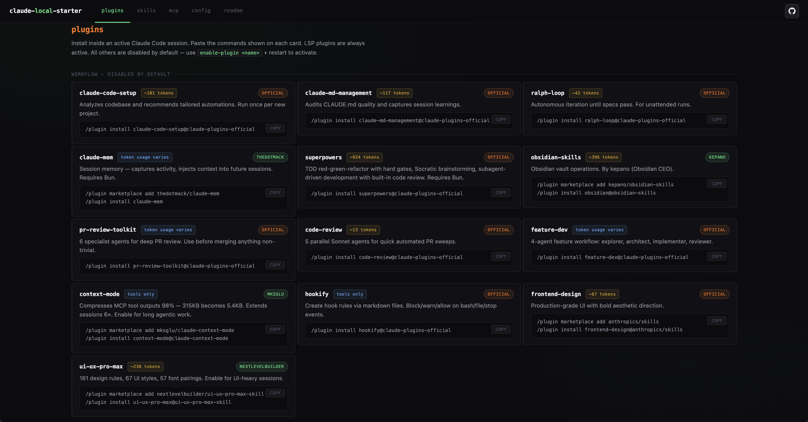
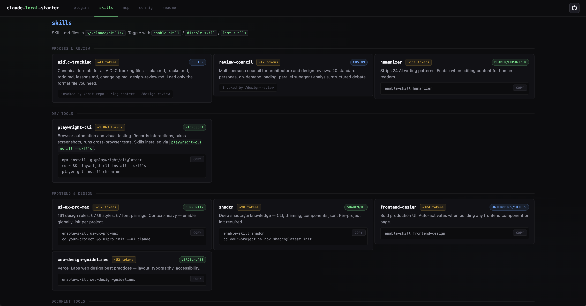
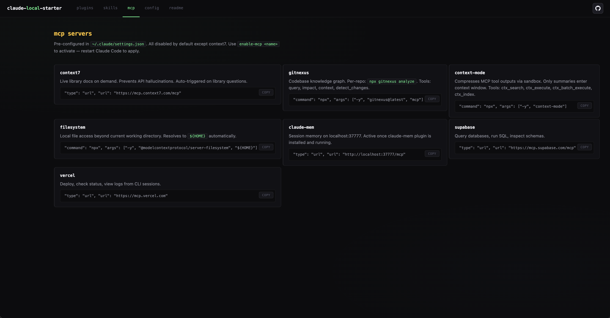
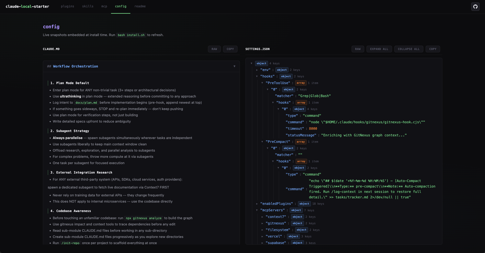
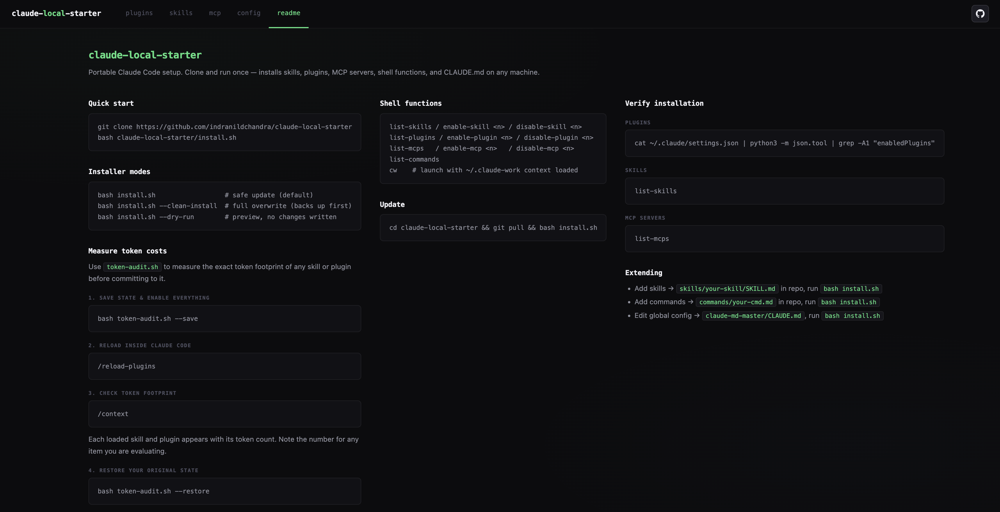

# claude-local-starter

Lift-and-shift your Claude Code setup onto any machine with a single script.

## Why this exists

Claude Code's real power isn't the model — it's what you build on top of it. Your `CLAUDE.md` shapes how it reasons. Your plugins define what agentic workflows it can run. Your skills control what domain knowledge it carries into every session. Your MCP servers determine what external systems it can reach. Your hooks automate the discipline that would otherwise quietly slip.

All of that lives in `~/.claude/` on one machine. It's not backed up. It's not in git. It silently disappears every time you set up a new laptop or need to work from somewhere else.

I kept hitting that wall. So I version-controlled the whole thing.

One `bash install.sh` on any machine and you're back to full speed: same behaviour, same token budget discipline, same toolchain, same dashboard to inspect what's running. No cloud environment required — and that part matters. Local dev gives you persistent shell state, your own filesystem, and a Claude that remembers your setup because your setup is actually there.

This isn't a generic starter. It's the specific lineup of plugins, skills, and MCP servers I've found most useful day-to-day, packaged into a single installer. Everything is off by default unless it's earned a place in the active session — most skills are context-off, most plugins are disabled, most MCPs are toggled off. You pay for what you actually use. The dashboard shows you exactly what you're loading and what it costs in tokens before you commit to it.

Think of it as the all-stars setup — not everything available, just the things that have proven genuinely useful across real work.

## What it installs

| Component | Details |
|-----------|---------|
| `~/.claude/CLAUDE.md` | Global Claude Code behaviour (from `claude-md-master/CLAUDE.md`) |
| `~/.claude/settings.json` | Plugins, env vars, MCP servers, hooks (deep-merged) |
| `~/.claude/skills/` | frontend-design, ui-ux-pro-max, shadcn, web-design-guidelines, humanizer, aidlc-tracking, review-council, ppt-creator |
| `~/.claude/commands/` | `/init-repo`, `/design-review`, `/log-context`, `/create-ppt` |
| LSP binaries | typescript-language-server (enabled), pyright (enabled), gopls, rust-analyzer, jdtls |
| Browser automation | `@playwright/cli` with skills + Chromium |
| MCP servers | context7 (enabled by default), gitnexus, context-mode, claude-mem, filesystem, supabase, vercel |
| Shell functions | see below |
| `~/.claude-work/` | Private context directory (load on demand with `cw`) |

## Usage

```bash
git clone https://github.com/indranildchandra/claude-local-starter
cd claude-local-starter
bash install.sh                  # safe update — merges, prompts for preferences
bash install.sh --clean-install  # full overwrite from repo (backs up first)
bash install.sh --dry-run        # preview all actions, no changes written
```

On update, the installer asks two questions:
- **Preserve existing `~/.claude/CLAUDE.md`?** (default: n — overwrite from master)
- **Preserve existing MCP / plugin / skill states?** (default: y — keep your toggles)

After install, reload your shell and open the dashboard:

```bash
source ~/.zshrc
open ~/.claude/claude-local-starter.html   # always open this, not the repo file
```

## Dashboard

A single-page HTML dashboard is injected with your live `settings.json` and `CLAUDE.md` at install time. Open it to see exactly what's configured, what's enabled, and what each component costs in tokens.

After running `install.sh`, your personal copy lives at:

```bash
~/.claude/claude-local-starter.html
```

Open it with:

```bash
open ~/.claude/claude-local-starter.html
```

Always open this installed copy — not the `claude-local-starter.html` file in the repo itself. The repo file is a template; the one in `~/.claude/` is the one with your actual `settings.json` and `CLAUDE.md` baked in.

| Plugins | Skills |
|---------|--------|
|  |  |

| MCP Servers | Config |
|-------------|--------|
|  |  |



## Key files

| File | Purpose |
|------|---------|
| `install.sh` | The installer — idempotent, safe to re-run |
| `token-audit.sh` | Measure token footprint of skills and plugins before enabling them |
| `claude-md-master/CLAUDE.md` | Source of truth for `~/.claude/CLAUDE.md` — always overwrites on install |
| `settings.json` | Source of truth for `~/.claude/settings.json` |
| `commands/` | Custom slash commands synced to `~/.claude/commands/` |
| `skills/` | Custom skills synced to `~/.claude/skills/` |
| `claude-local-starter.html` | Visual dashboard — open the copy at `~/.claude/`, not this file |

## Shell functions (available after install)

```bash
list-skills                  # show all skills with context-on/off state
enable-skill <name>          # let Claude auto-load skill at session start
disable-skill <name>         # user-invocable only, zero idle token cost

list-plugins                 # show all plugins with enabled/disabled state
enable-plugin <name>         # enable a plugin (restart Claude Code to apply)
disable-plugin <name>        # disable a plugin

list-mcps                    # show all MCP servers with enabled/disabled state
enable-mcp <name>            # enable an MCP server (restart Claude Code to apply)
disable-mcp <name>           # disable an MCP server

list-commands                # list all slash commands

cw                           # launch Claude with ~/.claude-work context loaded
                             # (exit and run plain 'claude' to go without it)
```

## MCP servers

All disabled by default except `context7`. Enable on demand with `enable-mcp <name>`.

| Server | Purpose | Source |
|--------|---------|--------|
| `context7` | Live documentation fetching (enabled by default) | [upstash/context7](https://github.com/upstash/context7) |
| `gitnexus` | Codebase knowledge graph — run `npx gitnexus analyze` per repo | [abhigyanpatwari/GitNexus](https://github.com/abhigyanpatwari/GitNexus) |
| `context-mode` | Compresses MCP tool outputs — extends long sessions | [mksglu/context-mode](https://github.com/mksglu/context-mode) |
| `claude-mem` | Session memory (requires claude-mem plugin) | [thedotmack/claude-mem](https://github.com/thedotmack/claude-mem) |
| `filesystem` | Local file access (`${HOME}`) | [modelcontextprotocol/servers](https://github.com/modelcontextprotocol/servers/tree/main/src/filesystem) |
| `supabase` | Database queries | [supabase-community/supabase-mcp](https://github.com/supabase-community/supabase-mcp) |
| `vercel` | Deploy and logs | [vercel-mcp](https://vercel.com/docs/agent-resources/vercel-mcp) |

## Plugins

Installed inside an active Claude Code session via `/plugin install`. See `~/.claude/plugin_commands.sh` after install.

| Plugin | Source |
|--------|--------|
| `claude-code-setup` | [anthropics/claude-plugins-official](https://github.com/anthropics/claude-plugins-official/tree/main/plugins/claude-code-setup) |
| `claude-md-management` | [anthropics/claude-plugins-official](https://github.com/anthropics/claude-plugins-official/tree/main/plugins/claude-md-management) |
| `ralph-loop` | [anthropics/claude-code](https://github.com/anthropics/claude-code/tree/main/plugins/ralph-wiggum) |
| `claude-mem` | [thedotmack/claude-mem](https://github.com/thedotmack/claude-mem) |
| `superpowers` | [obra/superpowers](https://github.com/obra/superpowers) |
| `obsidian-skills` | [kepano/obsidian-skills](https://github.com/kepano/obsidian-skills) |
| `pr-review-toolkit` | [anthropics/claude-code](https://github.com/anthropics/claude-code/tree/main/plugins/pr-review-toolkit) |
| `code-review` | [anthropics/claude-code](https://github.com/anthropics/claude-code/tree/main/plugins/code-review) |
| `feature-dev` | [anthropics/claude-code](https://github.com/anthropics/claude-code/tree/main/plugins/feature-dev) |
| `context-mode` | [mksglu/context-mode](https://github.com/mksglu/context-mode) |
| `hookify` | [anthropics/claude-code](https://github.com/anthropics/claude-code/tree/main/plugins/hookify) |
| `frontend-design` | [anthropics/claude-plugins-official](https://github.com/anthropics/claude-plugins-official/tree/main/plugins/frontend-design) |
| `ui-ux-pro-max` | [nextlevelbuilder/ui-ux-pro-max-skill](https://github.com/nextlevelbuilder/ui-ux-pro-max-skill) |
| `typescript-lsp` | [anthropics/claude-plugins-official](https://github.com/anthropics/claude-plugins-official/tree/main/plugins/typescript-lsp) |
| `pyright-lsp` | [anthropics/claude-plugins-official](https://github.com/anthropics/claude-plugins-official/tree/main/plugins/pyright-lsp) |
| `gopls-lsp` | [anthropics/claude-plugins-official](https://github.com/anthropics/claude-plugins-official/tree/main/plugins/gopls-lsp) |
| `rust-analyzer-lsp` | [anthropics/claude-plugins-official](https://github.com/anthropics/claude-plugins-official/tree/main/plugins/rust-analyzer-lsp) |
| `jdtls-lsp` | [anthropics/claude-plugins-official](https://github.com/anthropics/claude-plugins-official/tree/main/plugins/jdtls-lsp) |

## Skills

Synced to `~/.claude/skills/` on install.

| Skill | Source |
|-------|--------|
| `aidlc-tracking` | bundled (this repo) |
| `review-council` | bundled (this repo) |
| `ppt-creator` | bundled (this repo) |
| `humanizer` | [blader/humanizer](https://github.com/blader/humanizer) |
| `playwright-cli` | [microsoft/playwright-cli](https://github.com/microsoft/playwright-cli) |
| `ui-ux-pro-max` | [nextlevelbuilder/ui-ux-pro-max-skill](https://github.com/nextlevelbuilder/ui-ux-pro-max-skill) |
| `shadcn` | [shadcn-ui/ui](https://github.com/shadcn-ui/ui/tree/main/skills/shadcn) |
| `frontend-design` | [anthropics/skills](https://github.com/anthropics/skills/tree/main/skills/frontend-design) |
| `web-design-guidelines` | [vercel-labs/agent-skills](https://github.com/vercel-labs/agent-skills/tree/main/skills/web-design-guidelines) |
| `docx / pdf / pptx / xlsx` | bundled |

## Measuring token costs

Before enabling a new skill or plugin permanently, measure its token footprint:

```bash
bash token-audit.sh --save     # snapshot current state, enable everything
# Open Claude Code → /reload-plugins → /context (note token counts)
bash token-audit.sh --restore  # restore your original state
# Open Claude Code → /reload-plugins
```

## Plugin installation (manual)

Plugin commands only work inside an active Claude Code session. After install:

```bash
cat ~/.claude/plugin_commands.sh
# Open Claude Code and paste the commands
```

## Adding custom skills

Place skill directories under `skills/` — each needs a `SKILL.md`. They sync to `~/.claude/skills/` on install.

## Adding custom commands

Place `.md` files under `commands/` — they sync to `~/.claude/commands/` and become available as `/command-name` inside Claude Code.

## Custom-built components

A few things in this repo aren't pulled from anywhere — they're written specifically for this setup and the workflows behind it.

**Skills**

| Skill | What it does |
|-------|-------------|
| `aidlc-tracking` | Canonical formats for all project tracking files — `plan.md`, `todo.md`, `tracker.md`, `lessons.md`, `changelog.md`, `design-review.md`. Exists so Claude never invents its own structure for these files and every project looks the same. |
| `review-council` | Spins up a multi-persona review council for architecture and design decisions. 20 expert personas, parallel subagent analysis, structured debate, converges on a verdict with your input. Heavy but useful for decisions that actually matter. |
| `ppt-creator` | Full presentation pipeline from brief to `.pptx`. Research → narrative → design system enforcement → Visual QA before output. Produces conference-ready decks in a consistent personal design system. Triggered via `/create-ppt`. |

**Slash commands**

| Command | What it does |
|---------|-------------|
| `/init-repo` | Bootstraps a project from scratch — runs gitnexus analysis, writes a `CLAUDE.md` tailored to the codebase, and scaffolds all AIDLC tracking files in one shot. Run once per new repo. |
| `/design-review` | Triggers the `review-council` skill for a full architectural review. Pass a scope (file, module, or decision) or leave blank to review the whole repo. |
| `/log-context` | Writes a detailed session snapshot to `tasks/tracker.md` before compaction. Preserves enough context that a cold-start in the next session doesn't lose the thread. |
| `/create-ppt` | Triggers the `ppt-creator` skill. Walks through RESEARCH → ALIGN → STRUCTURE → GENERATE → REVIEW with checkpoints at each stage. Produces a named `.pptx` in the personal design system with full Visual QA before delivery. |

## Contributing

This repo is personal infrastructure, but if you've found something that makes Claude Code meaningfully better, a PR is welcome.

A few ground rules:

- **Don't add things for completeness.** Every plugin, skill, and MCP in here is here because it earned its place through actual use. If you're adding something, say why it's better than what's already here or what gap it fills.
- **Token cost matters.** Anything that loads into context by default needs to justify that cost. Check `token-audit.sh` before proposing anything context-on by default.
- **Keep the defaults conservative.** New additions should ship disabled. Let users opt in.
- **Test the installer.** Run `bash install.sh --dry-run` first, then `bash install.sh --clean-install` on a genuinely fresh setup before submitting. A dry run catching no errors is not the same as a clean install working end-to-end.

For custom skills and commands: follow the existing structure. Skills need a `SKILL.md`, commands need a `.md` file. Both should have a clear, narrow scope — do one thing well.
